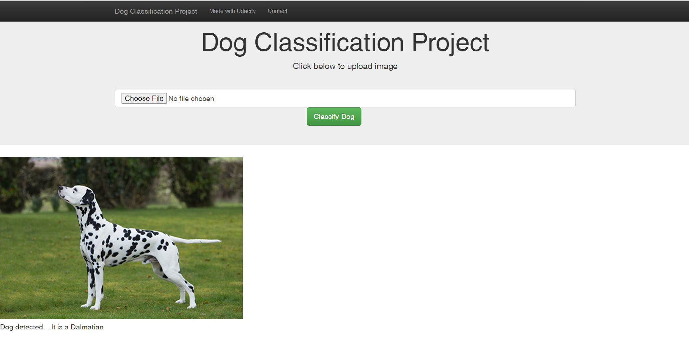

# dog-breed-classifier

### Table of Contents

1. [Installation](#install)

2. [Project Motivation](#motive)

3. [File Description](#desc)

4. [Screenshots](#rslts)

5. [Licensing, Authors, Acknowledgements](#ack)

## Installation
The project was written primarily in Python 3  and the libraries used are provided in the Anaconda Distribution in addition to the following:
**cv2,
Flask, 
torch,
PIL**

Run app from command line using **python web_app.py**

## Project Motivation
This project aims to classify different dog breeds. It can be used as a learning aid for children or just a fun way to know about the different dog breeds.
The app correctly classifies 133 different dog breeds with an 82% precision - that is much more than the average human :)
It can also be used to batch detect dogs or humans in several images
It does this in the below steps:

  1. Detects a dog in a given image
  
  2. Classifies the detected dog into the appropriate breed
  
  3. If a human is detected it finds the closest dog breed resemblance 

## File Description
**dog_app.py:** Python module to perform dog classification

**Data_Exploration.ipynb:** Notebook to explore raw data and visualize data

**dog_app_pytorch.ipynb:** Notebook to process data and train model

**web_app.py:** Module to launch Flask web app

**go.html/master.html** html files for web app

**model_transfer.pt** Output classifier pytorch model

## Screenshots

## Licensing, Authors, Acknowledgements
Please see  LICENSE and CODEOWNERS files
